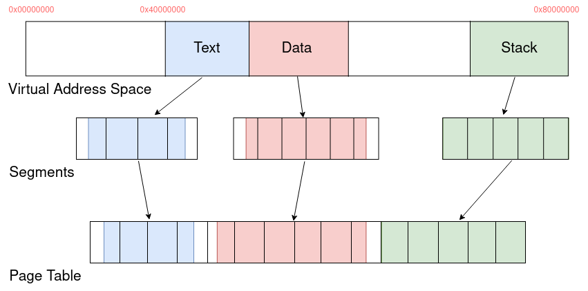
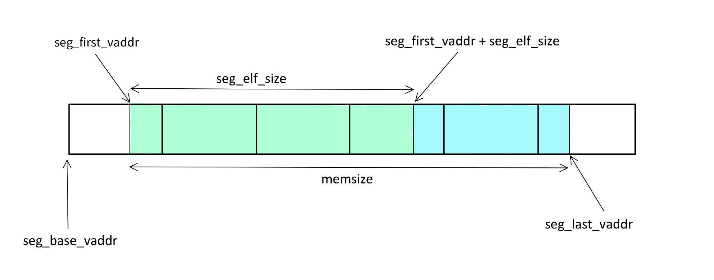

# OS161 Project C1 - Group 8

## 1 - Introduction

This paper describes the work done by Vincenzo Mezzela, Andrea Taurino and Riccardo Tornesello regarding the project inherent the OS internals part of the System and Device Programming course at Politecnico di Torino[.](http://ww.polito.it)
We improved **OS161** by including **Virtual Memory Management with Demand Paging and Swapping** (Cabodi project 1).
We chose to implement a per-process page table, handling the problem of the empty virtual memory area. Writing operations on read -only pages and illegal memory accesses are other minor details that we took care of in our project.

---

## 2 - Paging

The first upgrade over DUMBVM concerns paging. A coremap must be used to manage memory and instead of using ram.c for the memory bootstrap steps, the old system has been replaced by using only the coremap.

### 2.1 - Coremap structure

Let's analyze what we need to know about each memory frame.

To find free frames, the kernel performs a linear search in the coremap, so each entry will have a dedicated bit to indicate whether the corresponding frame is free or occupied.

It must also be remembered that, while userspace frames are allocated one at a time, in the current implementation of os161 the kernel could allocate multiple pages (contiguous for simplicity) with the `kmalloc` function, which will then be freed with `kfree`, so the length of the allocation must be known in order to deallocate all contiguous segments.

In our project we want to implement a per-process page table, this is a relevant factor since we need to know which process the entry in the coremap belongs to in order to update its page table following a swap out. Instead of indicating the process or its page table, it was decided to insert a pointer to the page table entry for reasons that will be more clear below.

An entry for each frame must be contained in the coremap. Let's do some calculations: consider the case of a 32-bit architecture, so 32 bits are needed to represent the physical address, each page is 4096B in size, so the last 12 bits of a physical address are not needed to index a frame. Therefore the index of a frame is representable in **20 bits**, this will be necessary for later optimizations to avoid memory waste. `frame_index = physical_index / 4096` or `frame_index = physical_index >> 12`

It is also useful to know whether the frame belongs to the kernel or the user but it would be redundant to add a field for that, in fact if the pointer to the address space of a process is NULL, then it belongs to the kernel.

Later it was also noted that a field was needed to indicate the lock of a certain frame to prevent it from being touched by other processes while the virtual memory performs other operations, e.g., it must be locked while performing a swap out.

Putting it all together results in the following struct:

```c
struct coremap_entry
{
    unsigned char       cm_used : 1;
    unsigned long       cm_allocsize : 20;
    unsigned char       cm_lock : 1;
    struct pt_entry     *cm_ptentry;            /*  page table entry of the page living
                                                    in this frame, NULL if kernel page  */
};
```

### 2.2 - Page allocation

The allocation of pages in memory turns out to be simple as long as there are free spaces.
Let's start by analyzing the case of kernel dedicated pages: they are allocated contiguously using the `kmalloc` function, so consecutive free pages are required to be in memory, also they are never moved in the SWAP.
User pages are allocated individually since this operation is called by the vm_fault when the page is not in memory. To find a free frame, the coremap is searched linearly; conversely, to free it, the coremap is modified indicating that the corresponding frame has become unused.
If in the allocation of a user page the memory is found to be totally occupied, the need to swap out occurs.

Victim selection is done with a simple round robin algorithm: starting with the victim index, it continues until a frame dedicated to user space is found (remember that kernel frames are not swapped out), then it is moved to the swapfile. At this point we need to insert in the page table of the process that owns that frame the index to which it was swapped, which is why in the coremap we chose to insert the pointer to the page table entry. Finally, after swapping the victim frame, we reset with zeros the corresponding memory area and return it as the new allocation.
This algorithm can be greatly optimized in three points:

- choose the victim by type: a read-only frame present in an ELF file does not need to be swapped out since it is already present in secondary memory.
- check what type of file is being swapped: at present, all frame types are swapped even if, as mentioned before, they are read only and present in the ELF. A check would ensure that frames are not swapped out unnecessarily. This has been done in our project.
- to prevent the kernel from running out of available memory for kmalloc, it should be possible to swap out several consecutive pages when needed or implement an algorithm that periodically swaps unused pages.

### 2.3 - User page allocation flow

1. The VM receives a fault
2. The kernel finds the corresponding entry in the page table
3. If the page is not in memory, page allocation is requested by calling `alloc_upage` and passing the page table entry
4. The function calls `getppages` which in turn calls `coremap_getppages`.
5. This function takes care of finding a free memory space or, if unavailable, freeing it using swap. If no available space is found it terminates the execution of the process when called because of a user segment or terminates the OS with panic in the case of kernel segments.
6. Finally `coremap_getppages` inserts the pointer to the page table entry in the coremap

---

## 3 - On demand page load

To allow pages to be loaded in physical memory on demand, two fundamental changes were made: not closing the ELF file and disable the loading of the entire segments from the `load_elf` function.

### 3.1 - Leaving the ELF file open

In order to leave the ELF file open we decided to perform some simple changes in the `runprogram` function where instead of closing the ELF file with `vfs_close` we decided to leave it open and save the pointer to the vnode in a new field in the process struct that we called called `p_vnode`.

```c
int runprogram(char *progname){
...
#if OPT_RUDEVM //our VM
	curproc->p_vnode = v;
#else
	/* Done with the file now. Original OS161 implementation */
	vfs_close(v);
#endif
...
}

struct proc {
...
	struct vnode *p_vnode;		/* process ELF vnode */
...
}
```

### 3.2 - Save the ELF file vnode.

In the original implementation of OS161 the `load_elf` function reads the ELF file header and then goes through the list of segments twice: once for setting up the address space for each segment and again to perform the load of the entire segment in the physical memory using the function `load_segment`.

In order to change this behavior, the first step was to simplify the `load_elf` by deleting the part where the entirety of all the segments was loaded.
We also changed the `as_define_region` function in order to exploit the new segment structure: it calls the appropriate functions to allocate and define properly the text and data segments in the address space segment structure.

```cpp
int as_define_region(struct addrspace *as, vaddr_t first_vaddr,
	size_t memsize, off_t elf_offset, size_t elfsize)
```

A substancial difference from the previous `as_define_region` implementation is the parameter `elf_offset` that is then saved in the `seg_elf_offset` field of the segment structure.
This value is essential for our purposes because, given a segment, it allows to easily find where it’s located inside the ELF file.

### 3.3 - Page loading

The fundamental improvements described above allowed us to create two new functions with the sole purpose of loading pages on demand: `as_load_page` and `load_page`.

These functions are called by the `vm_fault` function every time there’s a page fault relative to a page that has to be loaded from the ELF file.
We’ll say more about VM fault later.

`load_page`, whose prototype is declared below, is called inside `as_load_page` and takes as argument the vnode pointer `*v` of the ELF file to read from, the `offset` of the page of interest in the ELF file, the number of bytes `size` to read from ELF and the physical address `page_paddr` where the page/frame will be stored.

This function basically reads a page from the ELF file and stores it to physical memory.

```c
void load_page(struct vnode *v, off_t offset, paddr_t page_paddr, size_t size)}
```

Some considerations have to be made about the `size` parameter: as we know, in our implementation of OS161 the page size is 4KB, but that’s not always the case when loading a new page.
For example the first page of a segment doesn’t always start at an aligned virtual address that ends with 12 zero bits.

Below there’s an example of the program headers of the executable **sort.**
If we focus on the third row we can find information on the data segment and it’s immediate to see that the virtual address 0x00412780, the first of the segment, isn’t page aligned.

```bash
> readelf -l sort

Elf file type is EXEC (Executable file)
Entry point 0x400180
There are 3 program headers, starting at offset 52

Program Headers:
  Type           Offset   VirtAddr   PhysAddr   FileSiz MemSiz  Flg Align
  REGINFO        0x000094 0x00400094 0x00400094 0x00018 0x00018 R    0x4
  LOAD           0x000000 0x00400000 0x00400000 0x02780 0x02780 R E  0x10000
  LOAD           0x002780 0x00412780 0x00412780 0x000b0 0x1200c0 RW  0x10000
```

> We struggled for days with a problem in program execution where the fault address was found to be 0, which is impossible.
> We discovered at that time that we had mistakenly loaded the program into memory for two reasons:

1. we erroneously thought that the size of the segment in memory was equal to the size `FileSiz`of the segment in the ELF file. Instead it was `MemSiz`.
2. we thought that the first virtual address of a segment was page-aligned.
   >

In order to take into account all these issues we decided to create a new function `as_load_page` that acts as a wrapper for the function `load_page` and computes the `offset` and `size` parameters in the correct way.

```c
int as_load_page(struct addrspace *as,struct vnode *vnode, vaddr_t faultaddress)
```

`as_load_page` takes as input the addrspace of the process we are loading pages, the vnode pointer to the ELF file of the executable and the faultaddress that caused the page fault.

This function, in order to compute the right parameters, takes in consideration three cases:

- The requested page is the first of the segment

```c
if((segment->seg_first_vaddr & PAGE_FRAME )== ( faultaddress & PAGE_FRAME )){

		size = PAGE_SIZE - ( segment->seg_first_vaddr & ~PAGE_FRAME ) > segment->seg_elf_size ?
				segment->seg_elf_size :								/* in case the elfsize is smaller		*/
				(PAGE_SIZE - ( segment->seg_first_vaddr & ~PAGE_FRAME )) ;
		offset = segment->seg_elf_offset ;							/*  offset within the elf				*/
		target_addr = pt_row->pt_frame_index * PAGE_SIZE 			/*  physical base address				*/
					+ ( segment->seg_first_vaddr & ~PAGE_FRAME ) ;	/* 	offset within the segment 			*/
```

`size`: if there’s only one page in the segment the size is set to `seg_elf_size` (that corresponds to the `FileSiz` field in the ELF program header shown above), otherwise it will be set to
`PAGE_SIZE - segment->seg_first_vaddr & ~PAGE_FRAME` that is the difference between the PAGE_SIZE of 4KB and the last 12 bits of the `seg_first_vaddr`, which corrisponds to the `VirtAddr` field in the ELF file program header.

`offset`: since it’s the first page of the segment it’s set to the offset of the segment within the ELF.

`target_addr`: is the physical address where the frame will be stored and is set to `pt_row->pt_frame_index * PAGE_SIZE`, which is the page-aligned physical address of the memory that has been allocated for this page + the last 12 bits of `seg_first_vaddr`.

- The requested page is the last of the segment (stored in the ELF file)

```c
else if(((segment->seg_first_vaddr + segment->seg_elf_size) & PAGE_FRAME) == ( faultaddress & PAGE_FRAME )){

		size = (segment->seg_first_vaddr + segment->seg_elf_size) & ~PAGE_FRAME ;
		offset = segment->seg_elf_offset + 							/*	offset within the elf				*/
				(faultaddress & PAGE_FRAME) -					/*  base address of the faulting page	*/
				segment->seg_first_vaddr ;							/*  first vaddr of the segment			*/
		target_addr = pt_row->pt_frame_index * PAGE_SIZE;			/*	physical addr of the faulting page	*/

	}
```

`size`: is the number of bytes of the last page. Corresponds to the last 12 bits of `segment->seg_first_vaddr + segment->seg_elf_size`

`offset`: this page can be found in the ELF file at `segment->seg_elf_offset` + number of bytes between the first vaddr of the segment and the page-aligned vaddr of the faulting page

`target_addr`: it’s simply the physical address corresponding to the memory allocated for this page.

- The requested page is the middle of the segment

```c
else{
		/*	middle page of the segment	*/

		size = PAGE_SIZE;
		offset = segment->seg_elf_offset + 							/*	offset within the elf				*/
				(faultaddress & PAGE_FRAME) -					/*  base address of the faulting page	*/
				segment->seg_first_vaddr ;							/*  first vaddr of the segment			*/
		target_addr = pt_row->pt_frame_index * PAGE_SIZE;			/*	physical addr of the faulting page	*/

	}
```

`size`: is PAGE_SIZE, the size of the page in our system.

`offset` and `target_addr` are computed the same way as the previous case.

After performing these computations the `as_load_page` calls `load_page` whom will load the page from the ELF file to physical memory and after will then return to the calling function `vm_fault`.

---

## 4 - SWAP

To implement SWAP, the kernel runs a bootstrap function at startup, it opens the SWAPFILE file and keeps it open all the time.
This is just a small module that is called by the coremap, virtual memory or page table functions when there is a need to swap out or swap in.
The size of the SWAPFILE is 9MB, considering that the pages must be 4096 bytes (as large as the pages in memory) you have 0x900 pages, indexable in **12 bits** even though the last indexes will never be reached (useful for later optimizations). With 12 bits we can index up to 16MB but it can be a problem for bigger swapfiles, for this reason in `swapfile.h` there is the definition of `SWAP_INDEX_SIZE` which can be changed when `SWAPFILE_SIZE` varies.
To know which pages of the SWAPFILE are occupied and which are free, a bitmap is used in which each bit corresponds to a page: if the value is 1 then the page is occupied.
To swap out the kernel looks for an empty page using the swapmap and copies the contents of a frame to a page in the file and set the corresponding bit in the swapmap to 1; conversely, to swap in you take a page from the swapfile starting at a certain index and load it into a frame, then set the bit to 0.
This is how the swapmap is created:

```c
static struct bitmap *swapmap;
swapmap = bitmap_create(SWAPFILE_SIZE / PAGE_SIZE);
```

### 4.1 - SWAP optimization

Wanting to implement an efficient solution, we thought about the small optimizations.
Upon analysis of the operation of our solution we realized that some writes to secondary memory could be avoided, for example, it is useless to swap a page that is read-only since it is already present in equal form in the ELF file.
Since we implemented on-demand paging, the ELF file always remains open in order to read pages that have not yet been loaded into memory. So it's possible to read from the program binary file instead of reading from the SWAPFILE since there is no advantage in terms of read speed because both the ELF file and the swapfile are stored in secondary memory, on the contrary it can avoid a write when swapping out, saving time, and also saves space in the SWAPFILE.
This optimization can be enabled or disabled via the `noswap_rdonly` option in the kernel configuration.

---

## 5 - Address space

In the original version of **OS161**, only `.text` (read only) and `.data` (read&write) segments are specified in the headers of ELF files. By exploiting this information, it can be derived that in the virtual address space of the program contains three segments: `text`, `data` and `stack`. In the original version of os161 they are allocated contiguously but with the page table there is no longer this limitation.
Consider that the user's virtual memory space is mapped from `0x000000` to `0x80000000` and the page size is 4096 bytes, so you can have at most `0x80000` pages. A simple version of the page table would have `0x80000` entries, but it would be a waste of memory considering the various unused areas. It was decided to use a different strategy to solve the empty memory problem: the page table contains entries only for those pages which belong to a segment. Finding the correct index within the page table become slightly more complex since `index = vaddr / PAGE_SIZE` is no longer correct having skipped the empty region in the page table.

The figure below summarize the logic behind the address space and how each segments is mapped by the page table. It can even be noticed that some little empty region are still present within the used pages, because typically the first and last virtual address of the segments are not multiples of the `PAGE SIZE` , it is the **internal fragmentation**.



### 5.1 - Address space structure

The address space structure contains data regarding the three segments and the page table. For a better modularity and readability of the code it was decided to use pointers to data structures instead of having all inside the addrspace structure.

```c
struct addrspace {
        struct segment    *as_text;
        struct segment    *as_data;
        struct segment    *as_stack;
				struct pt_entry   *as_ptable;
}
```

### 5.2 - Segment structure

```c
struct segment {
    vaddr_t     seg_first_vaddr;
    vaddr_t     seg_last_vaddr;
    size_t      seg_elf_size;
    off_t       seg_elf_offset;
    size_t      seg_npages;
};

```

For each segment it is needed to store several informations to locate it within the virtual address space and to load the pages from the elf file.

More in details, the segment has to be stored starting from the first address, up to the last address. Whereas in order to load each page correctly from the elf file it is also needed to know the offset where the segment is located in the elf file. Moreover, it is possible that the segment belongs only partially to the elf, for this reason also the size of this segment portion has to be stored in order to know whether the page has to be loaded from the elf or it is enough to allocate and zero fill it.

The figure below represent a segment and better clarify the role of each field.



It would also be useful to know the permissions for each segment, e.g., the `.text` is read-only while `.data` and `.stack` are read-write, so we can put a field for permissions in the segment structure, however since the number of segments is fixed and we also know the types, in the address space we will indicate the three segments and based on their names we can deduce the read and write permissions.

### 5.3 - Page table structure

```c
#define NOT_LOADED 0
#define IN_MEMORY 1
#define IN_SWAP 2
#define IN_MEMORY_RDONLY 3

struct pt_entry
{
    unsigned int frame_index : 20;
    unsigned int swap_index : SWAP_INDEX_SIZE;
    unsigned char status : 2;
};
```

The page table is useful in case of TLB misses to find the physical address corresponding to the virtual address that caused the fault (the algorithm for finding the entry in the page table was described earlier) as well as finding the frame within the SWAPFILE.

Now some calculations: as mentioned above, only 20 bits are needed to index a frame and 12 (best size for 9MB SWAPFILE) to index a page in the SWAPFILE, so these will be the sizes of the relevant fields to indicate the location of the page in physical memory or in the SWAP. 20 bits + 12 bits = 32 bits, would seem to be the perfect and optimal size for a struct, however we chose to add an additional 2-bit field to indicate the state of the page, which may be `IN_MEMORY`, `IN_SWAP`, or `NOT_LOADED` (Only later another state `IN_MEMORY_RDONLY` has been added for in order to avoid writing in the swap file the pages that are read-only and retrievable from the ELF file as we described before).
Originally we thought we would find the state of the page by reading the previous two fields:

- $frame\_index \neq 0 \wedge swap\_index = 0 : memory$
- $frame\_index = 0 \wedge swap\_index \neq 0 : swap$
- $frame\_index = 0 \wedge swap\_index = 0 : not\space loaded$

This would have created bugs since the indexes are in base 0 and so this value should also be accepted.

A similar but workable solution would have been possible using upper bound values, not for the frame index since even 2^20-1 may be an acceptable value, but knowing that not all swap indexes would be used. This solution, however workable, is inconvenient since it would create problems in case of future updates, such as increasing the size of the SWAPFILE.
The other solution that was considered was to have a field for the state and a field of `max(12,20)` bits for the index. Depending on the state (in memory or in swap) that index would indicate the index of the frame in memory or the page in the SWAPFILE.
At the end of all these considerations, it was felt that the best solution, for simplicity of the code and because the memory savings would be minimal, was to add a third field for status.

### 5.4 - How to get the page table index from the virtual address?

To get the entry in the page table from the virtual address it is needed to know in which segment of the address it resides. It can be considered a very trivial operation knowing the boundaries of each segment. In case the address does not belong to any segment, it is an illegal access of memory and the process should be killed.

```c
int
as_get_segment_type(struct addrspace *as, vaddr_t vaddr)
{
	KASSERT(as != NULL);

	if (vaddr >= as->as_text->seg_first_vaddr && vaddr < as->as_text->seg_last_vaddr)
  {
      return SEGMENT_TEXT
  }
  if (vaddr >= as->as_data->seg_first_vaddr && vaddr < as->as_data->seg_last_vaddr)
  {
      return SEGMENT_DATA;
  }
  if (vaddr >= as->as_stack->seg_first_vaddr && vaddr < as->as_stack->seg_last_vaddr)
  {
      return SEGMENT_STACK;
  }

  return 0;
}
```

Then we find the offset in the segment as the difference between the searched virtual address and the **base address** of the segment. The base address is basically the initial address of the page from which the `first_vaddr` belongs to, and can easily be computed as `first_vaddr & PAGE_FRAME` .

Finally the index within the page table is equal to the sum of the number of pages of the previous segments plus the offset from the current segment.

> e.g. : If the searched address belongs to the data segment, the number of pages of the previous segments has to be added, in this case it is only the number of pages of the text segment.

```c
static int pt_get_index(struct addrspace *as, vaddr_t vaddr){
    unsigned int pt_index;

    KASSERT(as != NULL);

    switch(as_get_segment_type(as,vaddr)){
        case SEGMENT_TEXT:
            pt_index = ( vaddr - (as->as_text->seg_first_vaddr & PAGE_FRAME) ) / PAGE_SIZE;
            KASSERT(pt_index < as->as_text->seg_npages);
            return pt_index;
        case SEGMENT_DATA:
            pt_index = as->as_text->seg_npages + ( vaddr - (as->as_data->seg_first_vaddr & PAGE_FRAME) ) / PAGE_SIZE;
            KASSERT(pt_index <  as->as_text->seg_npages + as->as_data->seg_npages);
            return pt_index;
        case SEGMENT_STACK:
            pt_index = as->as_data->seg_npages + as->as_text->seg_npages + (vaddr - (as->as_stack->seg_first_vaddr & PAGE_FRAME) ) / PAGE_SIZE ;
            KASSERT(pt_index <  as->as_data->seg_npages + as->as_text->seg_npages + as->as_stack->seg_npages);
            return pt_index;
        default :
            panic("invalid segment type! (pt_get_index)");
    }

    return 0;
}
```

---

## 6 - VM fault

The `vm_fault` function defined in our project is deeply different from the DUMBVM implementation, yet it’s still the most important piece that puts together everything we’ve done, in order to achieve the goals of the project.

This function is called every time the requested vaddr is not present in the TLB or if an illegal operation like writing on a readonly page is attempted.

The function, like the one in `dumbvm.c`, receives two parameters:

- faulttype - the type of page fault received, `VM_FAULT_READONLY` if the system tries to write a page whose dirty bit is not flagged on in the relative TLB entry or `VM_FAULT_WRITE`/`VM_FAULT_READ` for attempted read/write access to a page not present in TLB.
- the virtual address `vaddr` that caused the page fault.

```c
int vm_fault(int faulttype, vaddr_t faultaddress)
```

### 6.1 - Write on read-only page

When a process tries to write on a read-only page, it will trigger the `vm_fault` with code `VM_FAULT_READONLY` . Whenever it falls in this case, the process is killed in a very trivial way by means of the `sys__exit()` which is called directly within the kernel.

```c
int vm_fault(int faulttype, vaddr_t faultaddress){
...
switch (faulttype)
	{
 	    case VM_FAULT_READONLY:
			**kprintf("vm: got VM_FAULT_READONLY, process killed\n");
			sys__exit(-1);**
			return 0;
	    case VM_FAULT_READ:
	    case VM_FAULT_WRITE:
			break;
	    default:
			return EINVAL;
	}
...
}
```

In order to exploit this piece of code we need to set up the TLB entry in the proper way using the `tlb_insert` function and passing the value `1` (true) to the `ro` (read-only) parameter when storing the page in physical memory during the VM fault.

```c
void tlb_insert(vaddr_t vaddr, paddr_t paddr, bool ro);
```

This function inserts a new entry in the TLB for the vaddr-paddr pair and sets up the dirty bit properly based on the `ro` parameter passed to tlb_insert.
This function also makes use of a round-robin replacement strategy regarding the TLB entries.

In order to test this functionality we wrote a small program, _nosywrite_, located in the testbin folder that attempts a write into the text segment:

```c
int main(void){
    int *invalid_pointer = (int *)0x400000;
    *invalid_pointer = 3;
    return 0;
}
```

Where the address `0x400000` is the base address of the text segment.

### 6.2 - Read/Write type faults

Read or write type faults are generated if the requested virtual address is not present in the TLB. This can happen in several cases, which will be analyzed individually below.

The first operation performed by the vm_fault function is page-aligning the received faultaddress and then using it, along the address space, to retrieve the pointer to the correspondant pt_entry with `pt_get_entry()` and the information regarding the type of segment the faultaddr belongs to with `as_get_segment_type()`.

```c
int vm_fault(int faulttype, vaddr_t faultaddress){
...
basefaultaddr = faultaddress & PAGE_FRAME;

	if(!(seg_type = as_get_segment_type(as, faultaddress))){
		kprintf("vm: got faultaddr out of range, process killed\n");
		sys__exit(-1);
	}
	pt_row = pt_get_entry(as, faultaddress);
	readonly = seg_type == SEGMENT_TEXT;
...
}
```

The `seg_type` information is also used to set the value of the `readonly` to 1 (true) if the fault address belongs to the text segment.

Possible scenarios given the value stored in the `pt_status` field of the relative pt_entry:

- `case IN_MEMORY`/`IN_MEMORY_RDONLY`: the page is already in physical memory but its TLB entry has been replaced to make room for other entries. In this case the corresponding entry is added to the TLB by obtaining the physical address from the page table.
- `case NOT_LOADED` and `seg_type == SEGMENT_STACK`: not loaded stack page.
  Stack pages are originally empty and are not read from the ELF file, so the kernel allocates a new page in memory, stores its physical address in the page table and adds the entry to the TLB.
- `case NOT_LOADED` and `seg_type != SEGMENT_STACK`: not loaded data or text page.
  The first step is allocating physical memory for the page by calling `alloc_upage()` then, while text pages must always be filled with data from the ELF file, the same doesn’t necessarily apply to the data pages, so it must be checked.
  To find out whether the page needs to be retrieved from the ELF file or not, the function
  `as_check_in_elf(struct addrspace *as, vaddr_t vaddr)` is called.
  This function returns `true` if the passed vaddr belongs to a page stored in the ELF file and returns `false` otherwise.
  If returns `true` the function `as_load_page()` we described before is called and the page is read from ELF and stored in the physical memory address allocated before.
  At the end of the process the physical address is saved in the page table and the relative entry is added to the TLB.
- `case IN_SWAP`: the page is in swap due to memory shortage.
  The page has been moved to the SWAPFILE, so a frame must be allocated in memory, filled with the data present in the SWAPFILE at the index given in the page table. Then the page table is updated by removing the index of the swapfile and adding the physical address.
  At the end the TLB entry is stored in TLB.

In every scenario if the page belongs to the text segment, the added TLB entry will be read-only.

Below there’s a code snipped of the described functionalities.

```c
int vm_fault(int faulttype, vaddr_t faultaddress)
{
...
	switch(pt_row->pt_status)
	{
		case NOT_LOADED:
			/*	alloc a page				*/
			page_paddr = alloc_upage(pt_row);
			pt_set_entry(pt_row,page_paddr,0, readonly ? IN_MEMORY_RDONLY : IN_MEMORY);

			/*	load the page if needed 	*/
			if(seg_type != SEGMENT_STACK && as_check_in_elf(as,faultaddress))
			{
				as_load_page(as,curproc->p_vnode,faultaddress);
			}
			break;
		case IN_MEMORY_RDONLY:
		case IN_MEMORY:
			break;
		case IN_SWAP:
			/*	alloc the page				*/
			page_paddr = alloc_upage(pt_row);
			/*	swap it from the elf file into memory	*/
			swap_in(page_paddr, pt_row->pt_swap_index);
			/* update page table	*/
			pt_set_entry(pt_row,page_paddr,0, readonly ? IN_MEMORY_RDONLY : IN_MEMORY);
		break;
		default:
			panic("Cannot resolve fault");
	}
	KASSERT(seg_type != 0);

	/* update tlb	*/
	tlb_insert(basefaultaddr, pt_row->pt_frame_index * PAGE_SIZE, readonly);
	return 0;
}
```

---

## 7 - Statistics

As required in the project, it is necessary to keep track of 10 events. For them, an array of strings containing the name of the event, useful when you want to print the result, and an array containing the number of times that event occurs are declared in memory.
Each time an event occurs, the `vmstats_hit` function is called, which increments the occurrence counter of the specific event. A spinlock is used here to prevent multiple CPUs from trying to increment the value at the same time.
The function `vmstats_print` was also created to show the results when the operating system shuts down, called in the `shutdown` function of `vm.c`.

### 7.1 - Statistics triggers

- TLB Fault: on `vm_fault`
- TLB Fault with Free: on `tlb_insert` if not all `NUM_TLB` entries have been used
- TLB Fault with Replace: on `tlb_insert` in the opposite case to the previous one
- TLB Invalidation: on `tlb_invalidate`, after an `as_activate`
- TLB Reload: on `vm_fault` if the page is already in memory (state `IN_MEMORY`)
- Page Fault (Zeroed): whether the address belongs to a never-loaded (`NOT_LOADED`) page of type SWAP or not present in the ELF file
- Page Fault (Disk): the page is either `NOT_LOADED` and saved in the ELF or has been previously swapped out (`IN_SWAP`)
- Page Fault from ELF: on `as_load_page` when the page is in the ELF file and has to be loaded in memory
- Page Fault from Swapfile: on `swap_in`
- Swapfile write: on `swap_out`

---

## 8 - Tests

The test suite we used is as follows:

- at
- at2
- bt
- km1
- km2
- km3 1000
- testbin/palin
- testbin/huge
- testbin/sort
- testbin/ctest
- testbin/matmult

We also created the following tests:

- testbin/nosywrite to obtain `VM_FAULT_READONLY`
- testbin/hugematmult1
- testbin/hugematmult2 (out of swap space)

Then we created a script (`execute_tests.py`) to automatically execute all the user test scripts and obtain execution time and statistic results, even in different ram size conditions. It also performs a long stability test by executing all the tests many times. The results are automatically stored in a markdown file (`testresults.md`), the results are reported below.

### 8.1 - User programs

| RAM: 512K                 | palin  | huge   | sort   | matmult | matmult1 | matmult2 | ctest  |
| ------------------------- | ------ | ------ | ------ | ------- | -------- | -------- | ------ |
| Execution time            | 15.541 | 39.080 | 20.864 | 7.4875  | 56.832   | -        | 1464.0 |
| TLB Faults                | 13986  | 7458   | 6720   | 4341    | 64464    | -        | 248545 |
| TLB Faults with Free      | 13986  | 7439   | 6578   | 4319    | 64446    | -        | 248530 |
| TLB Faults with Replace   | 0      | 19     | 142    | 22      | 18       | -        | 15     |
| TLB Invalidations         | 7824   | 6697   | 2979   | 1218    | 8771     | -        | 247943 |
| TLB Reloads               | 13981  | 3879   | 5055   | 3533    | 58866    | -        | 123624 |
| Page Faults (Zeroed)      | 1      | 512    | 289    | 380     | 2350     | -        | 257    |
| Page Faults (Disk)        | 4      | 3067   | 1376   | 428     | 3248     | -        | 124664 |
| Page Faults from ELF      | 4      | 58     | 25     | 13      | 78       | -        | 1605   |
| Page Faults from Swapfile | 0      | 3009   | 1351   | 415     | 3170     | -        | 123059 |
| Swapfile Writes           | 0      | 0      | 0      | 0       | 3759     | 5043     | 0      |

| RAM: 4M                   | palin  | huge   | sort   | matmult | matmult1 | matmult2 | ctest  |
| ------------------------- | ------ | ------ | ------ | ------- | -------- | -------- | ------ |
| Execution time            | 15.487 | 0.9164 | 3.4657 | 0.6779  | 42.957   | 56.902   | 7.3881 |
| TLB Faults                | 13897  | 4002   | 2008   | 947     | 38331    | 60192    | 125333 |
| TLB Faults with Free      | 13897  | 778    | 122    | 191     | 37010    | 58785    | 151    |
| TLB Faults with Replace   | 0      | 3224   | 1886   | 756     | 1321     | 1407     | 125182 |
| TLB Invalidations         | 7797   | 182    | 40     | 72      | 6213     | 8154     | 40     |
| TLB Reloads               | 13892  | 3487   | 1715   | 564     | 33600    | 54176    | 125073 |
| Page Faults (Zeroed)      | 1      | 512    | 289    | 380     | 2350     | 2977     | 257    |
| Page Faults (Disk)        | 4      | 3      | 4      | 3       | 2381     | 3039     | 3      |
| Page Faults from ELF      | 4      | 3      | 4      | 3       | 7        | 9        | 3      |
| Page Faults from Swapfile | 0      | 0      | 0      | 0       | 2374     | 3030     | 0      |
| Swapfile Writes           | 0      | 3451   | 1567   | 721     | 5450     | -        | 123242 |

### 8.2 - Kernel tests

| Test name | Passed |
| --------- | ------ |
| at        | True   |
| at2       | True   |
| bt        | True   |
| km1       | True   |
| km2       | True   |
| km3 1000  | True   |

### 8.3 - Stress test

| TLB Faults | TLB Faults with Free | TLB Faults with Replace | TLB Invalidations | TLB Reloads | Page Faults (Zeroed) | Page Faults (Disk) | Page Faults from ELF | Page Faults from Swapfile | Swapfile Writes |
| ---------- | -------------------- | ----------------------- | ----------------- | ----------- | -------------------- | ------------------ | -------------------- | ------------------------- | --------------- |
| 3455961    | 3453839              | 2122                    | 2753799           | 2090311     | 37890                | 1327760            | 17800                | 1309960                   | 1344230         |

---

## 9 - Work division

Organizing the work in such a complex project, in which all components collaborate with each other, can be difficult.
We decided to proceed with an initial study phase in parallel and then discuss together all the ideas, concerns, and possible implementation strategies.

For development, we assigned several small tasks to each to create minimal functions without linking them together: Riccardo did TLB, an elementary version of SWAP functions while Vincenzo did the Coremap part and Andrea the Page Table one.

Next we moved on to putting the pieces together, such as creating the vm.c. Here it was necessary to work together so that we could discuss and check for errors, as well as the fact that a change in these functions could have broken other changes made in parallel. It was not necessary for all three of us to be connected at the same time, but we avoided, when necessary, working in parallel.
When it was possible to work independently, we used different branches for implementing new features or bugfixes.

The last phase was optimization and troubleshooting, for example at the end of the implementation we ran into a problem that took days to be solved; it involved reading a variable that had already been overwritten in the swap out. Optimization involved improvements in victim choice algorithms, reduction of memory waste, and simplification of coremap and swap functions.

---

## 10 - Possible improvements

The project still leaves room for several improvements as it has a very basic virtual memory solution.

The page swapper swaps out pages that haven’t been modified, freeing the frames without swapping them out would reduce the number of writes to disk as the pages can be reloaded from the ELF file.

Both coremap and TLB victim selection exploit a very basic round robin victim selection, it can be improved using a more efficient algorithm.

Finding free frames within the coremap has a linear complexity, using a support structure (e.g. free frames list) would make it faster, but it would become slower to keep the data structure updated.

---

## 11 - Conclusion

Implementing this project was an interesting challenge: our OS161 knowledge deepened as facing with the many decisions and issues the project led us to.

It’s been a good opportunity to reduce the gap between theoretical knowledge of an OS and the practical one which conceals a lot of complexity.

Even a usual task - like debugging - has been challenging as it was like looking for a needle in a haystack. Therefore solving each issue arisen during the development brought us a lot of satisfaction because we felt our skills were improving (even though discovering the problem has sometimes been frustrating).